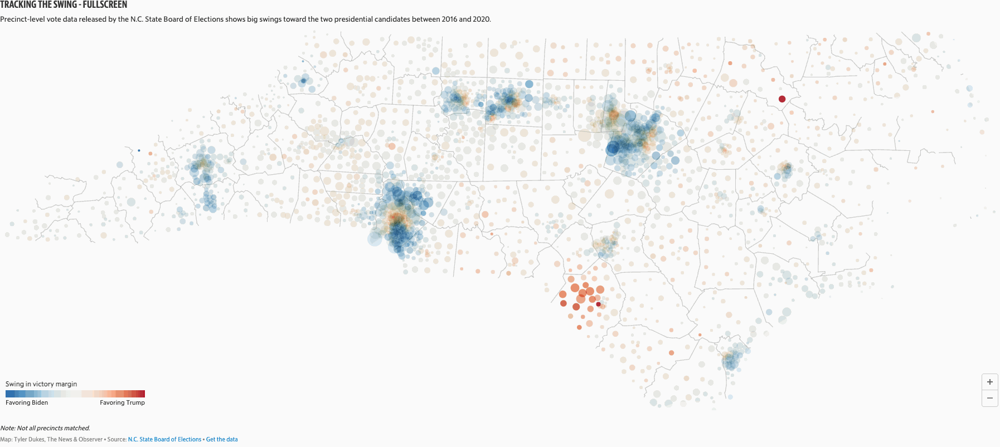

# 2020 precinct sort analysis

Voters who cast their ballots provisionally or by absentee in North Carolina elections aren't placed in their assigned precincts for the initial results. That happens weeks later, when the N.C. State Board of Elections produces county-level precinct sort files.

Precinct sort data gives us fine-grained insight into voting patterns for every contest down to what is essentially the neighborhood level.

Reporters at The News & Observer analyzed precinct sort files from 2020 and 2016 to see how things changed over four years from one general election to the next.

**_PLEASE NOTE: These findings are preliminary and still subject to review and change._**

## Top-level findings

[See a fullscreen version of this interactive map here.](https://datawrapper.dwcdn.net/2ZqwZ/1/)

Overall, growth in Democratic votes outpaced Republican votes in the presidential elections between 2016 and 2020.

Candidate|Votes in 2016|Votes in 2020|Raw change|Percent change
--|--|--|--|--
Donald J. Trump|2,363,065|2,758,845|395,780|16.75
Clinton/Biden|2,189,315|2,684,438|495,123|22.62

Because of precinct changes and leftover votes in administrative districts, matching 2016 and 2020 precinct data isn't always perfect. But the matched results are largely similar to the overall results.

Candidate|Votes in 2016|Votes in 2020|Raw change|Percent change
--|--|--|--|--
Donald J. Trump|2,302,330|2,688,615|386,285|16.78
Clinton/Biden|2,109,164|2,598,803|489,639|23.21

Both views of the data show a net shift of about 100,000 votes to Democrats in the presidential race.

From 2016 to 2020, only 139 of 2,658 precincts flipped from Biden to Trump or vice versa. But a vast majority of those flips went to Biden – and they accounted for larger net gains for Democrats.

Flip|Precinct count| Raw vote swing
--|--|--
Trump to Biden|115|34,072
Biden to Trump|24|2,108

Biden outperformed Clinton's margin in more than 1,600 precincts across the state in 2020, compared to the 1,000 or so precincts in which Trump outperformed his 2016 showing.
Outperformer|Precinct count|Raw vote swing
--|--|--
Biden|1,611|291,417
Trump|987|108,167
Unmatched|60|NA

Compared to 2016, Biden lost votes in about twice as many precincts as Trump. That translates into a loss of more than twice as many voters.
Candidate|Precincts with lost votes|Total votes lost
--|--|--
Trump|143|8,029
Biden|271|18,430

Conversely, Biden improved on Clinton's vote totals in a smaller number of precincts than Trump did. But those precincts translated in a larger number of actual votes.

Candidate|Precincts with gained votes|Total votes gained
--|--|--
Trump|2,445|394,314
Biden|2,318|508,069

That leaves 10 precincts that matched vote totals for Trump in 2016/2020 and 9 for Democrats.

## Histograms

### Distribution of precincts by swing in victory margin from 2016 to 2020

### Distribution of precincts by swing in net votes from 2016 to 2020

## The data

The News & Observer used the following publicly available data from the N.C. State Board of elections

- [2016 precinct sort files](https://dl.ncsbe.gov/?prefix=ENRS/2016_11_08/results_precinct_sort/)
- [2020 precinct sort files](https://dl.ncsbe.gov/?prefix=ENRS/2020_11_03/results_precinct_sort/)
- [October 2016 precinct map shapefile](https://s3.amazonaws.com/dl.ncsbe.gov/PrecinctMaps/SBE_PRECINCTS_20161004.zip)
- [October 2020 precinct map shapefile](https://s3.amazonaws.com/dl.ncsbe.gov/PrecinctMaps/SBE_PRECINCTS_20201018.zip) 

## Methodology
For a detailed breakdown of the code used for this analysis, [see our R script here](https://github.com/mtdukes/precinct-analysis-2020/blob/main/ps_analysis_clean.R).